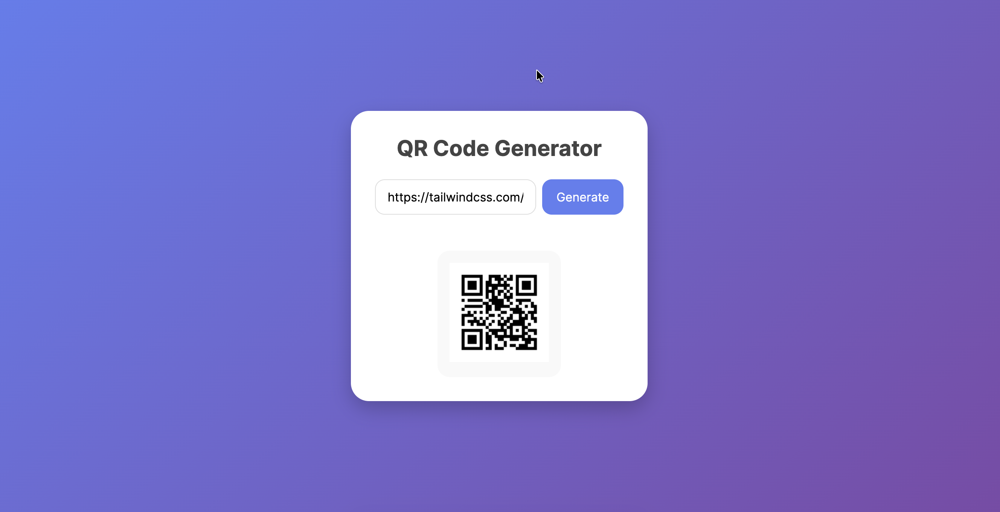

# 📱 QR Code Generator (React + JavaScript)

A modern **QR Code Generator** built with **React.js** and **qrcode.react** library.  
It allows users to enter text or a URL, generate a QR code instantly, and download it as a PNG image.  
Styled using **Tailwind CSS** for a sleek, modern UI.

---
## View Demo 




---

## 🚀 Features
- ✅ Generate QR codes from text or URLs  
- ✅ Modern UI with gradient background & responsive card design  
- ✅ Instant preview of QR code  
- ✅ Download QR code as PNG image  
- ✅ Built with **React.js** + **Tailwind CSS**  

---

## 🛠️ Tech Stack
- [React.js](https://react.dev/)  
- [qrcode.react](https://www.npmjs.com/package/qrcode.react)  
- [Tailwind CSS](https://tailwindcss.com/)  

---

## 📂 Project Setup

1. **Clone the repo**
   ```bash
   git clone https://github.com/developermickey/JavaScript-Interview-Questions.git
   cd JavaScript-Interview-Questions
